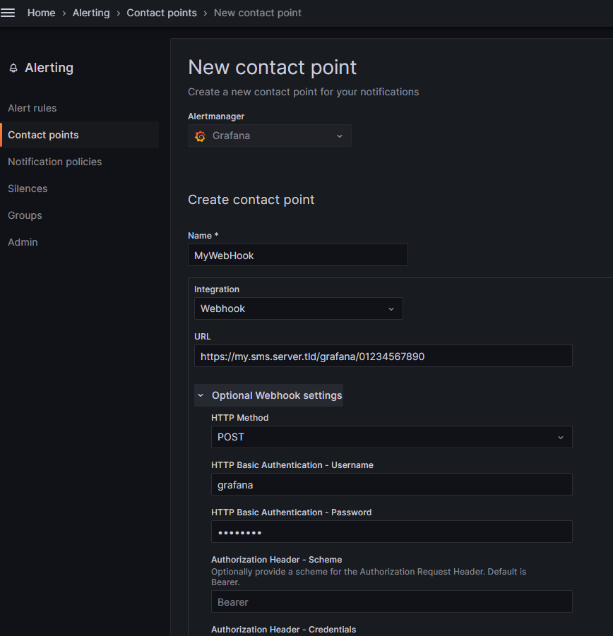

# Grafana webhook to gammu smsd server

This (quick and dirty) tool allows to receive grafana alerts in webhook format, and transfer it's content to an SMS gateway.  
Any SMS gateway that can be command line driven can be supported.

In the example config file, gammu_smsd is used.

## Requirements

You need a working SMS service that can be triggered by CLI (can be triggered directly or via curl)

## Setup

Install and setup a python environment
```
cd /opt
git clone https://github.com/netinvent/grafana_webhook_api
python3 -m venv /opt/grafana_webhook_api/venv
/opt/grafana_webhook_api/venv/bin/python -m pip install -r /opt/grafana_webhook_api/requirements.txt
```

Configure the file `/opt/grafana_webhook_api/grafana_webhook_api.conf` according to your needs.  
By default, it's configured to use Gammu-smsd-inject command to send SMS. 

Setup the service
```
cp /opt/grafana_webhook_api/examples/systemd/grafana_webhook_api.service /etc/systemd/system/
systemctl enable grafana_webhook_api
systemctl start grafana_webhook_api
systemctl status grafana_webhook_api
```

Don't forget to setup the firewall. Example for RHEL:
```
firewall-cmd --add-port=8080/tcp --permanent && firewall-cmd --reload
```

At this point, you can configure Grafana's webhook. Send endpoint is `/grafana` 



The url will be `http(s)://your_server.tld/grafana/{phone_number}` where `{phone_number}` must be replaced with actual number, URL encoded if needed.  
HTTP method should be post, and HTTP Basic authentication should be enabled.  
Please also use this server behind a HTTPS reverse proxy for better security.

You may add multiple phone numbers by separating them with a semicolon, eg
`http(s)://your_server.tld/grafana/0123456789;0234567890;02345678901`

You may also limit the number of sent sms by setting a minimal interval between two sent smses.  
The url will be `http(s)://your_server.tld/grafana/{phone_number}/{min_interval}`
Example, in order to not receive more than a SMS every two hours (7200 seconds):

`http(s)://your_server.tld/grafana/0123456789;0234567890;02345678901/7200`

### Testing your server in CLI mode

Once your server is setup, you can use CURL to check whether everything works.  
By using one of the test grafana calls found in `grafana-webhook-calls.txt` and the username/password configured in `grafana_webhook_api.conf`, you can execute the following test request to phone number 01234567890

```
curl -X POST -u grafana:MySecret!Password -H "Content-Type: application/json" -d '{"receiver": "test", "status": "firing", "alerts": [{"status": "firing", "labels": {"alertname": "TestAlert", "instance": "Grafana"}, "annotations": {"summary": "Notification test"}, "startsAt": "2024-03-09T11:10:16.31897622+01:00", "endsAt": "0001-01-01T00:00:00Z", "generatorURL": "", "fingerprint": "57c6d9296de2ad39", "silenceURL": "https://supervision.local/alerting/silence/new?alertmanager=grafana&matcher=alertname%3DTestAlert&matcher=instance%3DGrafana", "dashboardURL": "", "panelURL": "", "values": null, "valueString": "[ metric='foo' labels={instance=bar} value=10 ]"}], "groupLabels": {"alertname": "TestAlert", "instance": "Grafana"}, "commonLabels": {"alertname": "TestAlert", "instance": "Grafana"}, "commonAnnotations": {"summary": "Notification test"}, "externalURL": "https://supervision.local/", "version": "1", "groupKey": "test-57c6d9296de2ad39-1709979016", "truncatedAlerts": 0, "orgId": 1, "title": "[FIRING:1] TestAlert Grafana ", "state": "alerting", "message": "**Firing**\n\nValue: [no value]\nLabels:\n - alertname = TestAlert\n - instance = Grafana\nAnnotations:\n - summary = Notification test\nSilence: https://supervision.local/alerting/silence/new?alertmanager=grafana&matcher=alertname%3DTestAlert&matcher=instance%3DGrafana\n"}' http://localhost:8080/grafana/01234567890
```


